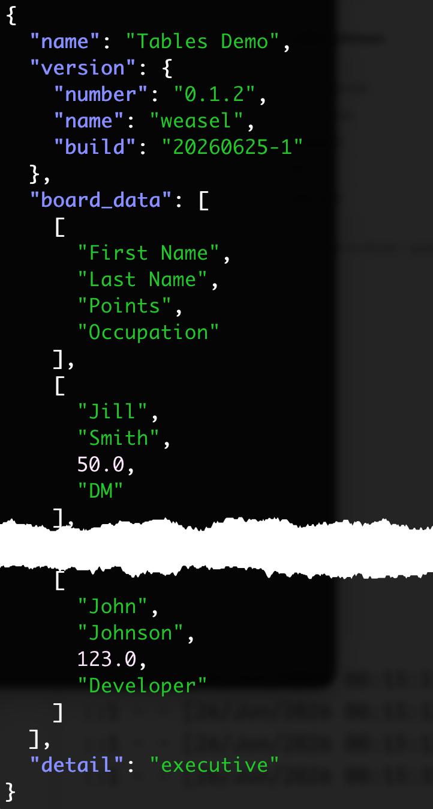

# HUBRIS Demo

This repository demonstrates, with a relatively simple spreadsheet,
how you can produce multiple documents from a single data source,
maintained in this case in a Google spreadsheet then downloaded
as an Excel `.xlsx` file.

## How it works

The generation process is driven by the `templates` directory,
which contains a collection of jinja2 HTML template files. (If you'd
like to see the templates they are linked from the demo).
A diagram of the process appears below, from which you can see
that HUBRIS processes the same `demo_data.xlsx` spreadsheet using three different
templates to produce three separate web pages.


## Marking up your Spreadsheet

To avoid too much change to the appearance or behaviour of your spreadsheet,
you mark up the data you want to extract principally by defining _named ranges_ containing extraction parameters.
The data the named ranges define can be anything that a spreadsheet cell can contain;
by keeping that data in a separate worksheet the impact is minimised.
For simplicity we here show everything on a single sheet.

HUBRIS will look for a range named "Parameters" but you can tell it
to start at some other range instead.
The only requirement is that the range should be made up of rows
each containing two cells.
Here is the Parameters range from `demo_data.xlsx`.


This defines four names (in the left-hand column)
with four corresponding values (in the right-hand column).
Each name in the parameters table appears in the extracted
output data, keying its corresponding value.
We'll be taking a look at the extracted data shortly.
The value will be a string containing the value you
see when you look at the spreadsheet.

Why the shading and the arrows on the values for `board_data` and `version`?
Because each of them is treated specially by HUBRIS.

The notation `[scoreboard]` means "the value associated with this name can be found
in the range named `scoreboard`." The range can be a single cell (although such
values are better handle with a cell reference than a range), a single row or column
(both of which yield a list of the values) or an N x M table of data, which
becomes a list of rows, each one a list of the values in each colum.

The notation `{version_data}` means that the range named `version_data` must again
be two columns wide, holding names on the left hand and values on the right.
Zooming out to the larger picture of the whole spreadsheet, with
named range definitions visible, gives you the general idea.


When HUBRIS processes the spreadsheet it produces the following output:



At this point, HUBRIS has completed its role. Each of the names in the
"Parameters" range (`name`, `detail`, `board_data` and `version`)
is associated with the relevant value. The values
associated with the `board_data` and `version` ranges are highlighted
for easy identification.

The data it has extracted according to the HUBRIS markup instructions
is then fed through a standard web templating engine
(in this particular case jinja2),
creating three different representations of the same
spreadsheet data.

You can see the outputs linked from [this page](out/index.html).


The following command shows how to create the corresponding
output file in the `out` directory.

```
uv run hubris demo_data.xlsx \
| uv run jinja -d - -f json template/levels.html > out/levels.html
```

The first part (`uv run hubris demo_data.xlsx`) extracts the data from the spreadsheet.
The second injects that data into a web page template to create a page that includes
the spreadsheet data it selects.
This is, in fact, what happens when you type

    make out/levels.html

To demonstrate the potential HUBRIS offers with even relatively simple data sources,
the same data is injected into three different templates, showing the same data
in substantially different ways.

The simple view provides an undecorated table with a few items of data in the headings.
The levels of detail view uses a few HTML tricks to show the data at three
different levels of detail - Executive, Summary and Full detail.
In full detail mode, click on an individual to see their expanded detail.
The initial display mode depends on the `detail` parameter.
The dashboard view is hopefully self-explanatory.

If you'd like to understand how the spreadsheet data is injected into the templates,
`templates/simple.html` is a good starting point.
The demo page links to each page's template for easy examination.

## Summary

HUBRIS lets you quickly mark up spreadsheets to extract data needed for other purposes
in a widely-reusable form.