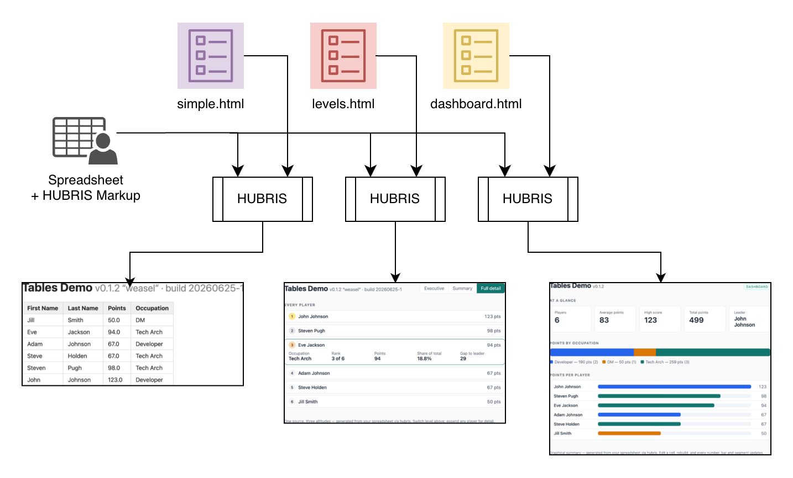
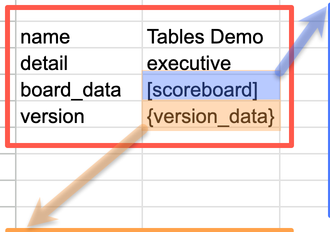
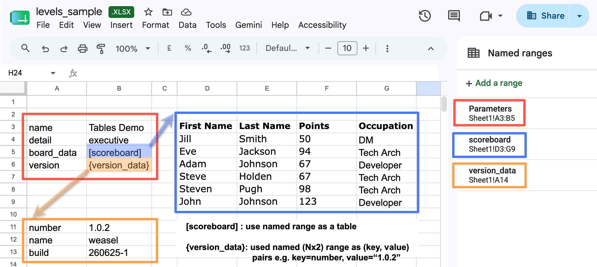

# HUBRIS Demo

This repository demonstrates, with a relatively simple spreadsheet,
how you can produce multiple documents from a single data source,
maintained in a Google spreadsheet.

## How it works

The generation process is driven by the `templates` directory,
which contains a collection of jinja2 HTML template files. (If you'd
like to see the templates they are linked from the demo).
A diagram of the process appears below, from which you can see
that HUBRIS processes the same `demo_data.xlsx` spreadsheet using three different
templates to produce three separate web pages.



## Marking up your Spreadsheet

To avoid too much change to the appearance or behaviour of your spreadsheet,
you mark up the data you want to extract principally by defining _named ranges_ containing extraction parameters.
The data the named ranges define can be anything that a spreadsheet cell can contain,
by keeping that data in a separate worksheet the impact is minimised.

HUBRIS will look for a range named "Parameters" but you can tell it
to start at some other range instead.
The only requirement is that the range should be made up of rows
each containing two cells.
Here is the Parameters range from `demo_data.xlsx`.



This defines four names (in the left-hand column)
with four corresponding values (in the right-hand column).
Each name in the parameters table appears in the extracted
output data, keying its corresponding value.
We'll be taking a look at the extracted data shortly.
The value will be a string containing the value you
see when you look at the spreadsheet.

Why the shading and the arrows on the values for `board_data` and `version`?
Because each of them is treated specially by HUBRIS.

`[scoreboard]` means "the value associated with this name can be found
in the range named `scoreboard`."

`{version_data}` means that the range named `version_data` must again
be two columns wide, names on the left hand and values on the right.
If we zoom out to the larger picture of the whole spreadsheet, with
named range definitions visible, you will probably get the idea.



When HUBRIS processes the spreadsheet it produces the following output:
```
{
  "name": "Tables Demo",
  "version": {
    "number": "0.1.2",
    "name": "weasel",
    "build": "20260625-1"
  },
  "board_data": [
    [
      "First Name",
      "Last Name",
      "Points",
      "Occupation"
    ],
    [
      "Jill",
      "Smith",
      50.0,
      "DM"
    ],
    [
      "Eve",
      "Jackson",
      94.0,
      "Tech Arch"
    ],
    [
      "Adam",
      "Johnson",
      67.0,
      "Developer"
    ],
    [
      "Steve",
      "Holden",
      67.0,
      "Tech Arch"
    ],
    [
      "Steven",
      "Pugh",
      98.0,
      "Tech Arch"
    ],
    [
      "John",
      "Johnson",
      123.0,
      "Developer"
    ]
  ],
  "detail": "executive"
}
```


The following command shows how to create the corresponding
output file in the `out` directory.

```
uv run python hubris_demo.py demo_data.xlsx \
    | uv run jinja -d - -f json templates/index.html > out/index.html \
    && open out/index.html
```

This is, in fact, what happens when you type

    make out/index.html

