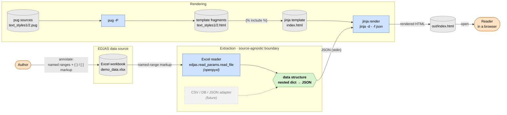
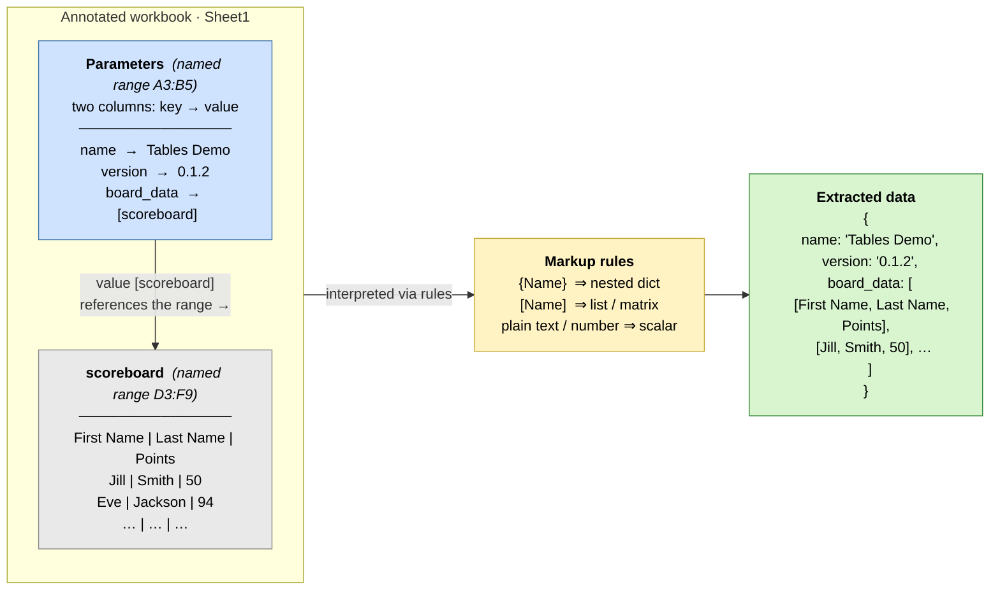

# EDJAS production process — dataflow

This is the bird's‑eye view of how a spreadsheet becomes a published HTML page.
It is deliberately high‑level: the details of *how* EDJAS reads a data source live
in the [`edjas`](https://pypi.org/project/edjas/) package, not in this demo. The
point here is to see **the shape of the pipeline** and, in particular, the one boundary
that keeps the design adaptable to data sources other than Excel.

The whole thing is driven by `make out/index.html`, which orchestrates three
independent producers (extract, compile, render) that meet at the final page.

---

## Diagram A — the production pipeline

Notation: rounded *stadiums* are external entities (people), plain *rectangles* are
processes, *cylinders* are stored files, and the *hexagon* is the in‑memory data that
ties everything together. Arrows are labelled with what flows along them.

The dashed box is the important teaching point: extraction happens behind a
**source‑agnostic boundary**. Today only the Excel reader exists, but anything that can
emit the same nested‑dict/JSON shape (a CSV file, a database, a JSON API) could be
plugged in without the rendering half of the pipeline knowing or caring.

**Reading it left to right**

1. **Authoring.** The author takes an ordinary Excel workbook and *annotates* it with
   defined names and a little reference markup (Diagram B explains this). That annotated
   workbook is the EDJAS *data source*.
2. **Extraction.** `read_file` opens the workbook and walks the named ranges, producing
   a plain nested dictionary — serialised here as JSON. This is the **pivot**: from this
   point on, nothing downstream is Excel‑specific.
3. **Compilation (a side stream).** The reusable `text_styles` fragments are compiled
   from Pug sources into HTML, ready to be ``d.
4. **Rendering.** `jinja` merges the JSON data with `index.html` (and its included
   fragments) to produce `out/index.html`, which is then opened in a browser.

> Detailed extraction semantics — how named ranges, nesting and value types are
> interpreted — belong to the `edjas` package and are intentionally left as a black box
> here.

---

## Diagram B — how a workbook becomes a EDJAS data source

This zooms into step 1. A *plain* spreadsheet carries no structure EDJAS can use; you
turn it into a data source by adding **defined names (named ranges)** and a two‑column
**key → value** layout, where a value may itself *reference* another named range.

**The convention in one breath**

- The root named range is **`Parameters`**: a two‑column table read as key → value pairs.
- A value can be a **scalar** (`name → "Tables Demo"`), a **dict reference** `{OtherRange}`,
  or a **list/matrix reference** `[OtherRange]` pointing at another named range.
- In this demo, `board_data → [scoreboard]` pulls in the `scoreboard` range as a table,
  giving the nested structure on the right — exactly the JSON that feeds Diagram A's
  rendering step.

That single indirection — *a cell value that names another range* — is what lets a flat
grid of cells describe an arbitrarily nested data structure, and it's the only "markup"
an author has to learn.
